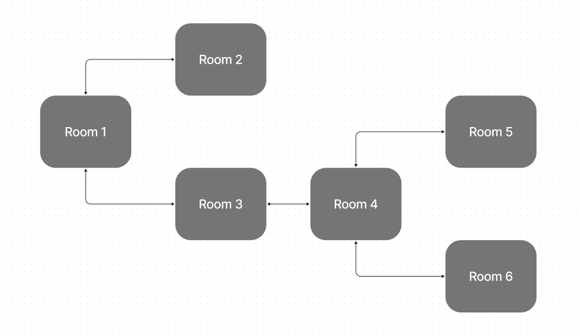

# Lookup Tables AKA Dictionaries AKA Hash Maps

A lookup table is an object that is used to map strings to other values.

The search is used as a key in the object, and the result for that search term is the corresponding value.

Lookup tables are useful in many situations, such as:

* searching abbreviations to find full words
* keeping track of your program's work by mapping an item from a list to the output
  * you can use this to avoid repeat work
* efficiently processing user input

---

# Lookup Table Example and Practice

```js

function getPoemTitle (authorUserSelected) {
  
  let poemTitlesByAuthor = {
    "Robert Frost": "Stopping by Woods on a Snowy Evening",
    "Shel Silverstein": "Falling Up",
    "Sylvia Plath": "The Bell Jar"
  };

  return poemTitlesByAuthor[authorUserSelected];
};

console.log(getPoemTitle('Sylvia Plath'))
```

> Try making a function that gets a song from a list of musicians and song titles and send it via DM in Discord.

---

# State Machines

A **state machine** is a system with a number of defined 'states'. The system can only be in one **state** at a time and has rules that determine how it 'transitions' between states.

An object is one kind of state machine. The keys reference the current state, and the values of those keys are the allowable transitions.

They also use a function to determine if they can change to a certain state while preventing invalid state changes.

---

# State Machine Example: Traffic Light


1. How many states? What are their names?
2. Can it be in more than one state at a time?
3. What are the rules for transitioning between states?

<figure>
  
  <figcaption>image by <a href="https://www.flickr.com/photos/katerha/6919352910">katerha</a></figcaption>
</figure>

---

# State Machine Example: Traffic Light Cont.

```
[🟢] → [🟡] → [🔴] ↤↦ [⚠️]
  ↖⎽⎽⎽⎽⎽⎽⎽⎽⎽⎽⎽⎽」 

```

* Green can transition to yellow
* Yellow can transition to red
* Red can transition to *either* a warning to yield or back to green
* The warning to yield can transition back to Red.

---

# Setting up the Allowable Transitions

The first step when creating a state machine is to set up an object that will hold your allowable transitions. You will need a key to represent each possible state, and a value that's an array of possible transitions.

```js
let states = {
  green: ["yellow"],
  yellow: ["red"],
  red: ["green", "yield"],
  yield: ["red"]
}
```

---

# Moving Between States

To enforce our state machine we will create a function that knows what the current state is, and accepts the next state as an argument.

If the change from the current state to the next state is valid we change our current state, otherwise we throw an error and the state doesn't change.

```js
let currentState = "green";

function enterState(newState) {
  let validTransitions = states[currentState];
  if (validTransitions.includes(newState)) {
    currentState = newState;
    console.log(currentState)
  } else {
    throw("Invalid state transition attempted - from " + currentState + " to " + newState;)
  }
}
```

---

# Using our State Machine

Now we can run through some state transitions using our state machine.

```js
enterState("yellow")
enterState("red")
enterState("yellow")
```

Note that the last call to `enterState` *should* throw an error, because `"yellow"` is not a valid transition from `"red"`

---

# Why Use a State Machine?

1. Clarity
2. Predictability
3. Fail-fast debugging

* Many bugs are due to the system receiving unexpected input, or input that is inappropriate *at the moment*
* an "illegal state transition" error means something unexpected *just* happened
* Without a state machine, the system may remain in an invalid state for some time
  * this makes it harder to debug once something eventually *does* break

---

# State of the State

> The term "state" has several overlapping meanings.

* in general, "state" means any data
  * especially in OO, e.g. "state and behavior" means "instance variables and instance methods"
* in particular, "state" means "there is a clear state transition diagram at work here"

> The term "state machine" has several technical variants as well.

* "Infinite State Machine" e.g. Turing Machine
* "Finite State Machine" or "Finite State Automaton" e.g. Conway's Game of Life

<https://en.wikipedia.org/wiki/Finite-state_machine>

---

# Transitioning Between Objects

Often times you will want to do more than just change from one string to another. You'll need to transition between more complex data structures like objects.

We can combine state machines, and lookup tables to allow for more complex interactions.

You can still keep track of the current state as a string, and use our state machine just as we previously set it up. The difference comes in how we use that current state. If you need to map it to an object you can create a lookup table which you access *at the current state*

## States Rooms Example Diagram
This is for rooms.js


# Object-Oriented Design

There are many object-oriented languages. While they differ in their syntax they all share a common set of design principles.

JavaScript is an object-oriented language, and a functional language, and a procedural language. It is known as a multi-paradigm language.

Since JavaScript is not purely object-oriented, these principles act more like guidelines.

---

## Object-Oriented Principles

Object-oriented languages are built on core principles.

- Encapsulation of an Object's **data** and **behavior**, by exposing an interface.
- Inheritance of common behavior, from a **parent Class** that **shares methods**.
- Abstraction of complexity, by hiding **implementation details**.
- Polymorphism of behavior, by responding to **messages by name** and **argument type**.

---

## Encapsulation Definition

Encapsulation is the act of keeping data within an object as properties, and using methods to access that data.

There are some guidelines to keep in mind when using Objects that follow object-oriented design.

---

## Encapsulation Example

By using the `.describe()` method of the `dog`, you are accessing the data within the dog by using its **public API**. This is opposed to going **inside** the dog and getting the data for yourself.

```js
const fido = {
  name: 'fido',
  color: 'brown',
  describe () { 
    return `Hello! My name is ${this.name} and I am ${this.color}.`
  }
}

// RECOMMENDED
console.log(fido.describe());

// DISCOURAGED
console.log(`Hello! My name is ${fido.name} and I am ${fido.color}`);
```

---

## Encapsulation Question

> Why would you want to use the public API of the dog object, instead of reaching inside the object the the data you may need?

Example code from prior slide:

```js
console.log(fido.describe());

console.log(`Hello! My name is ${this.name} and I am ${this.color}`);
```

---

## Inheritance Definition

Classes are a key component of Object-Oriented Design. Child classes **inherit** behavior using the `extends` keyword. This allows objects created from one class to use the behavior of another class.

In this relationship one class is a **child** and the other class is the **parent**.

```js
class Tomato extends Fruit { ... }
```

---

## Inheritance Example Step-1

Using Classes allows for another class to inherit behavior.

```js
class Animal {
  constructor(name, color) { 
    this.name = name;
    this.color = color; 
  }

  sleep() { return `${name} is going to sleep ... `}

  describe() {
    return `Hi there, I am ${name}, my color is ${color}!`;
  }
}
```

---

## Inheritance Example Step-2

 Child Classes inherit behavior using the `extends` keyword.

```js
class Animal { ... } // from prior slide

class Dog extends Animal {
  constructor(name, color) { 
    // uses the parent class constructor
    super(name, color)
  }

  // .sleep() comes from the parent class

  describe() {
    // *overrides* the parent describe method
    return `A ${color} colored dog named ${name} says Woof!`;
  }
}
```

---

## Inheritance Questions

- Why do you think Inheritance may be useful?

- Why do you think Inheritance may be complex?

- What alternatives to Inheritance can you imagine?

---

## Abstraction Definition

Abstraction is the act of hiding complexity, often this is by moving the complexity behind an object's methods.

Ideally, an object only uses two sources of data.

- Parameters to methods when they are invoked
- Properties of the method's own object, meaning the object `this` references
- All processing is performed by sending **messages** to other objects, as collaborators

---

## Abstraction Example

The code uses a method of `rectangle` to access the internal object state.

```js
class Rectangle {
  constructor(height, width) {
    this.height = height;
    this.width = width;
  }
  area () {
    return this.height * this.width;
  }
}

const shape = new Rectangle(10, 8);

function showArea(shape) {
  return `The shape's area is: ${shape.area()}`;
}
```

---

## Abstraction Counter Example

The following code is **not** Abstracted, complexity is present by manipulating the object directly, instead of using its methods.

```js
class Rectangle {
  constructor(height, width) {
    this.height = height;
    this.width = width;
  }
  area () {
    return this.height * this.width;
  }
}
const shape = new Rectangle(10, 8)
function showPerimeter(rectangle) {
  return `The perimeter is: ${rectangle.height * 2 + rectangle.width * 2}`;
}
showPerimeter(shape);
```

---

## Abstraction Questions

- Could a method be created on `Rectangle` to abstract the perimeter calculation complexity?

```js
class Rectangle {
  constructor(height, width) {
    this.height = height;
    this.width = width;
  }
  area () {
    return this.height * this.width;
  }
}

const shape = new Rectangle(10, 8)

function showPerimeter(rectangle) {
  return `The perimeter is: ${rectangle.height * 2 + rectangle.width * 2}`;
}
```

---

## Abstraction Question Solution

Add a `perimeter` **method**, so that `rectangle.perimeter()` accesses the `height` and `width` properties using `this`, performs the calculation, and returns the value.

```js
class Rectangle {
  constructor (height, width) {
    this.height = height;
    this.width = width;
  }
  area () {
    return this.height * this.width;
  }
  perimeter () {
    return this.height * 2 + this.width * 2;
  }
}
const shape = new Rectangle(10, 8)
console.log(rectangle.perimeter());
```

---

## Polymorphism Definition

**Polymorphism** is a complicated word for a simple idea. It means that Objects should respond to **messages** based on the **messages names** alone.

All **child classes** must respond to all the same **messages** as the **parent class**.

When two objects respond to the same **messages**, meaning the names of **properties** and **methods**, they are said to be **polymorphic**, and therefore share the same **shape**.

---

## Polymorphism Example

```js
class Fruit {
  constructor (hasSeeds, flavor) {
    this.hasSeeds = hasSeeds; 
    this.flavor = flavor;
  }
  describeFlavor() { ... }
}

class Tomato extends class Fruit { ... }
class Avocado extends class Fruit { ... }

tomato.describeFlavor()  // "tangy and sweet"
tomato.hasSeeds          // true
avocado.describeFlavor() // "rich and savory"
avocado.hasSeeds         // true
```

---

## Polymorphism Questions

- Why would it be useful for different objects to respond to the same messages?

- How could you use Polymorphism to make your programs simpler?

- If an object looks like a duck, and quacks like a duck, can we consider it a duck?

---

## Using a Linguistic Metaphor for Objects

Objects are **data structures** that hold **state** and **behavior** together.

When considering how to name objects, properties, and methods, use the following mental model.

- Objects are nouns, and represent things in the program
- Methods are verbs, and represent actions the objects do
- Properties are adjectives, they describe the object as a **noun**
- Classes are categories, something that describes a **type** of thing, not a thing itself